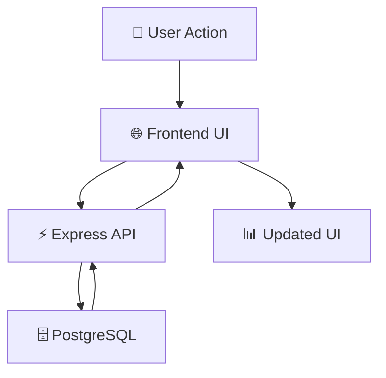

# 📈 StockHUB

### ⚡ Minimal Stack • Maximum Clarity

<p align="center">
  
  
  
</p>

<p align="center">
  <b>Clean CRUD is not basic — it's foundational.</b><br/>
  This project demonstrates how simplicity + structure can build real systems.
</p>

---

## 🚀 What is StockHUB?

StockHUB is a **full-stack stock management system** built to highlight:

> How a **minimal tech stack + strong database design** can create a reliable, scalable application.

No unnecessary frameworks.
No overengineering.
Just **clean architecture and efficient data flow**.

---

## ✨ Why This Project Stands Out

Most CRUD apps stop at *“it works.”*
StockHUB focuses on *“it works well.”*

* ⚡ Real-time UI updates after every operation
* 📊 Data visualization (sector-wise distribution)
* 🧠 Structured PostgreSQL schema (not ad-hoc storage)
* 🔄 Clean REST API design
* 📦 Preloaded dataset simulating real portfolios

---

## 🧩 Core Functionality

| Operation | Description                        |
| --------- | ---------------------------------- |
| ➕ Create  | Add new stock entries              |
| 📋 Read   | Display structured stock data      |
| ✏️ Update | Modify stock details               |
| ❌ Delete  | Remove stocks instantly            |
| 🔄 Sync   | Immediate UI refresh after changes |

---

## 🎬 System Flow



> Smooth **request → database → response loop** ensures consistency and responsiveness

---

## 📊 Data Visualization Layer

Beyond CRUD, StockHUB adds a **decision layer**:

* 📌 Pie chart showing **stock distribution by sector**
* Helps users quickly understand portfolio composition

---

## 🧠 Database Design Philosophy

<details>
<summary>Click to explore</summary>

This project treats PostgreSQL as a **core system component**, not just storage:

* Strongly typed schema
* Efficient query structure
* Auto table creation on startup
* Persistent and reliable data handling

Preloaded dataset includes:

* Apple, Microsoft, Tesla, Amazon, Google
* Meta, Nvidia, JPMorgan, Berkshire Hathaway
* Coca-Cola, Visa, Walmart, Johnson & Johnson
* Chevron, Samsung

👉 Simulates a **real-world stock environment**

</details>

---

## 🛠️ Tech Stack

<p align="center">
  
</p>

---

## 📁 Project Structure

```bash
stockHUB/
│── public/            # Frontend (UI + scripts)
│── db.js              # PostgreSQL connection
│── server.js          # API routes & logic
│── sqlCURD.sql        # Schema + queries
│── package.json
│── .gitignore
```

---

## ⚙️ How It Works

```text
User interacts with UI
        ↓
Frontend sends API request
        ↓
Express processes logic
        ↓
PostgreSQL executes query
        ↓
Updated data returned
        ↓
UI refreshes instantly
```

---

## 🔌 API Overview

| Method | Endpoint    | Description      |
| ------ | ----------- | ---------------- |
| GET    | /stocks     | Fetch all stocks |
| POST   | /stocks     | Add new stock    |
| PUT    | /stocks/:id | Update stock     |
| DELETE | /stocks/:id | Delete stock     |

---

## 🚀 Getting Started

### 1. Clone Repo

```bash
git clone https://github.com/your-username/stockHUB.git
cd stockHUB
```

### 2. Install Dependencies

```bash
npm install
```

### 3. Setup Database

```bash
psql -U your_user -d your_db -f sqlCURD.sql
```

### 4. Configure DB

```js
const pool = new Pool({
  user: "your_user",
  host: "localhost",
  database: "your_db",
  password: "your_password",
  port: 5432,
});
```

### 5. Run Server

```bash
node server.js
```

🌐 Open: http://localhost:3000

---

## 🎯 Key Takeaway

> Strong systems don’t come from complexity —
> they come from **clarity in data flow and design**.

---

## 🔮 Future Enhancements

* 🔐 Authentication (JWT)
* 📈 Advanced analytics
* 📊 Filtering & pagination
* 🌐 Deployment
* 🧪 Testing

---

## 💬 Philosophy

> Master CRUD → Master backend systems.

---

## 👨‍💻 Author

Vedant Palande

---

## 📄 License

MIT License
